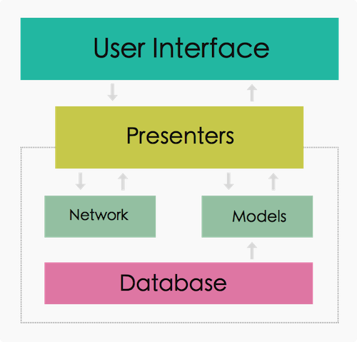

# MVPdemo
an Android demo for MVP mode!

说明：

    Model【实体类】:
        实体类、与传统的MVC中的mode一样；
        包含抽象的model业务逻辑接口、也包含具体的业务实体类

    View【前端UI】：
        （Activity）业务抽离出去，因此变得轻量级；基本上之需要负责一些view、对象的初始化等，指责单一、功能简单、易于维护；

    ViewInterface【抽象接口，Presenter与View之间沟通的纽带】:
        抽象化、较独立
        基于前端业务需求前提下的抽象接口，只负责定义根据View中需要抽象出来的业务逻辑，完成view与presenter直至向下的model之间的数据传输。

    Presenter【中间人、媒介】:
        具体化、重量级、处理业务逻辑；
        依赖于抽象的ViewInterface，而不是Activity(View), 这样，在UI易变性的情况下，只需要更新 ViewInterface 以及相关的逻辑，即可快速与Presenter配合，成本较低。
        向上实现"抽象"的ViewInterface接口，向下持有Model的"抽象"引用。 （抽象---为了松耦合！）

    具体的Presenter + 抽象的View
    Presenter 与 View(Activity) 之间是完全解耦合的。

    View和Model之间不能只结通信，唯一的通信方式就是Presenter

## MVP 框架图

 

## 模式带来的问题及解决方式

    问题1 Presenter对view的强引用可能会导致内存泄漏

        场景描述：
            presenter处理业务逻辑时经常需要执行一些耗时操作（eg：网络请求），因为Presenter持有了Activity【view统称，例如Fragment等也是一样的情况】的强引用，那么，
    如果在耗时操作结束之前，Activity被销毁，耗时操作还未返回，导致Presenter一直持有view对象，使得view对象无法被回收，导致了 内存泄漏！

        解决方式：
            通过弱引用及view（Activity、Fragment）的生命周期来解决！
            一般全局定义 view 和 presenter的范型抽象基类， 两者通过view的生命周期来回调通知到presenter中，完成资源的释放；例如 onDestroy() 中 调用BasePresenter的销毁方法，完成解除关联或销毁！

